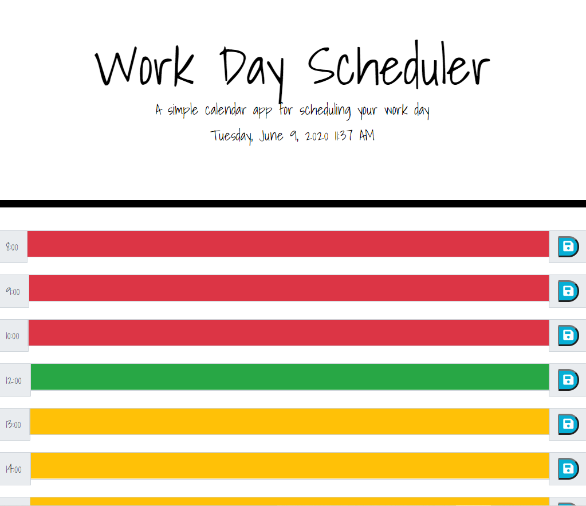

# 

#   

# DailyPlanner

## LiveLink
 https://git-theresa.github.io/DailyPlanner/

 ## Description
 Daily Planner allows users to schedule their day and save the agenda. The daily planner is color coded for time past, present, and future. Daily Planner is also updated in real date and time upon opening the application.

 
 

## Tecnology Stack
* HTML
* CSS
* Bootstrap
* JavaScript
* jQuery

### Contributor
@git-theresa

### Contact
* :computer:  GitHub: [https://github.com/git-theresa](https://github.com/git-theresa) 
* :e-mail:  Email: [t.eatherly@gmail.com](t.eatherly@gmail.com)
* :earth_americas:  LinkedIn: [https://www.linkedin.com/in/theresa-eatherly-4362b14a/](https://www.linkedin.com/in/theresa-eatherly-4362b14a/)

